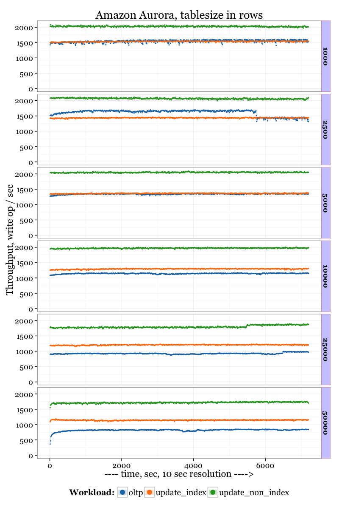
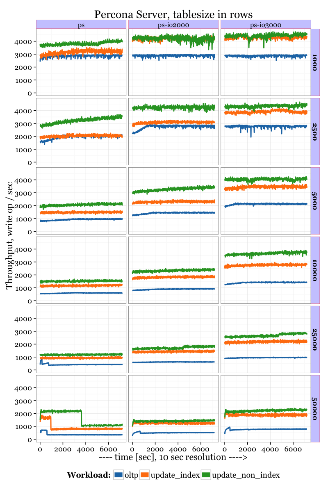
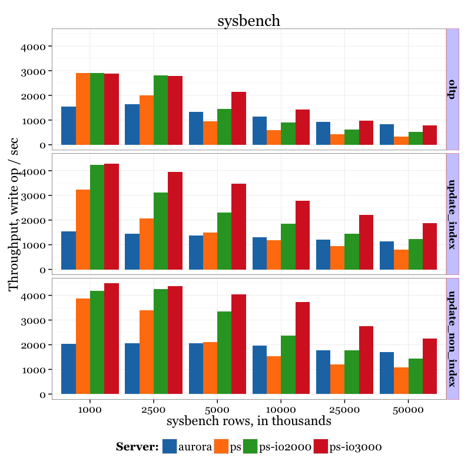

.. _aurora-sysbench-2015:

================================
Amazon Aurora Sysbench benchmark
================================

Benchmark date: Nov 2015.

The goal was to evaluate Amazon Aurora performance comparing to Percona Server.
The workload is `sysbench <https://github.com/akopytov/sysbench>`_ v0.5.
Scripts used for testing:

* oltp.lua (read-write)
* update_index.lua
* update_non_index.lua

Percona Server version: 5.6.27-75.0

Data sizes
-----------

Initial dataset: 32 sysbench tables, 50mln rows each. It corresponds to about 400GB of data.

Testing sizes: for benchmarks we vary max amount of rows used by sysbench: 1mln, 2.5mln, 5mln, 10mln, 25mln, 50mln.

In the chart results marked in thousands of rows as: 1000, 2500, 5000, 10000, 25000, 50000.
That is `1000` corresponds to 1mln of rows.

Estimated datasizes:

+--------------------+------+------+------+-------+-------+-------+
| rows, in thousand: | 1000 | 2500 | 5000 | 10000 | 25000 | 50000 |
+--------------------+------+------+------+-------+-------+-------+
| Size in GB:        |    8 |   20 |   40 |    80 |   200 |   400 |
+--------------------+------+------+------+-------+-------+-------+

In this way we emulate different datasizes from fully in-memory (1mln rows) to heavy-IO access (50 mln rows)

Instance sizes.
---------------
Actually it is quite complicated to find equal configuration (in both performance and price aspects)
to compare Percona Server running on EC2 instance against Amazon Aurora.

Amazon Aurora:

* db.r3.xlarge instance (4 virtual CPUS + 30GB memory)
* Monthly computing Cost (1-YEAR TERM, No Upfront): $277.40
* Monthly Storage cost: $0.100 per GB-month * 400 GB = $40
* extra $0.200 per 1 million IO requests

Total cost (per month, excluding extra per IO requests): `$311.40`

Percona Server
r3.xlarge instance (4 virtual CPUS + 30GB memory)
Monthly computing cost (1-YEAR TERM, No Upfront): $160.6

For the storage we will use 3 options:

* general purpose SSD volume (marked as `ps` in charts), 500GB size, 1500/3000 ios, cost: $0.10 per GB-month * 500 = $50
* Provisioned IOPS SSD volume (marked as `ps-io3000`), 500GB, 3000 IOP = $0.125 per GB-month  * 500 + $0.065 per provisioned IOPS-month * 3000 = $62.5 + $195 = $257.5
* Provisioned IOPS SSD volume (marked as `ps-io2000`), 500GB, 2000 IOP = $0.125 per GB-month  * 500 + $0.065 per provisioned IOPS-month * 2000 = $62.5 + $130 = $192.5

So corresponding total costs (per month) for used EC2 instances are: `$210.6`; `$418.1`; `$353.1`

Client setup
------------

For client we use t2.medium instance.
Sysbench runs with 16 users threads, which should be adequate to load the database instance.

sysbench script:

.. code-block:: bash

	for i in 50000 25000 10000 5000 2500 1000
	do
	sysbench --test=tests/db/oltp.lua --oltp_tables_count=32 --mysql-user=root --mysql_table_engine=InnoDB --num-threads=16 --oltp-table-size=${i}000 --rand-type=pareto --rand-init=on --report-interval=10 --mysql-host=HOST --mysql-db=sbtest --max-time=7200 --max-requests=0 run | tee -a au.${i}.oltp.txt
	done

Results
-------

Results for Amazon Aurora; 2 hours run, 10 sec resolution, to show variance of results

Results for Percona Server; 2 hours run, 10 sec resolution, to show variance of results

Results (averaged) Percona Server vs Amazon Aurora, in relation to datasize

Results in tabular format:

=========  =====  ================  =========
Server      Size  workload               ops
=========  =====  ================  =========
aurora      1000  oltp              1548.6490
ps          1000  oltp              2894.6190
ps-io2000   1000  oltp              2903.5302
ps-io3000   1000  oltp              2889.8827
aurora      2500  oltp              1653.0761
ps          2500  oltp              2009.9911
ps-io2000   2500  oltp              2809.9707
ps-io3000   2500  oltp              2783.0859
aurora      5000  oltp              1340.6739
ps          5000  oltp               955.1150
ps-io2000   5000  oltp              1452.4108
ps-io3000   5000  oltp              2132.9517
aurora     10000  oltp              1139.2001
ps         10000  oltp               596.4517
ps-io2000  10000  oltp               912.3408
ps-io3000  10000  oltp              1420.1322
aurora     25000  oltp               919.9039
ps         25000  oltp               418.1550
ps-io2000  25000  oltp               620.7486
ps-io3000  25000  oltp               964.7347
aurora     50000  oltp               824.9817
ps         50000  oltp               340.6678
ps-io2000  50000  oltp               509.2594
ps-io3000  50000  oltp               782.1511
aurora      1000  update_index      1541.7061
ps          1000  update_index      3230.3314
ps-io2000   1000  update_index      4228.8192
ps-io3000   1000  update_index      4279.5530
aurora      2500  update_index      1440.2293
ps          2500  update_index      2062.2836
ps-io2000   2500  update_index      3105.0119
ps-io3000   2500  update_index      3943.8099
aurora      5000  update_index      1366.3545
ps          5000  update_index      1492.3974
ps-io2000   5000  update_index      2315.1324
ps-io3000   5000  update_index      3465.8786
aurora     10000  update_index      1296.2791
ps         10000  update_index      1189.4472
ps-io2000  10000  update_index      1847.5573
ps-io3000  10000  update_index      2789.7427
aurora     25000  update_index      1209.9782
ps         25000  update_index       938.9404
ps-io2000  25000  update_index      1441.1059
ps-io3000  25000  update_index      2209.2510
aurora     50000  update_index      1140.1554
ps         50000  update_index       804.7809
ps-io2000  50000  update_index      1230.8842
ps-io3000  50000  update_index      1881.0907
aurora      1000  update_non_index  2029.6650
ps          1000  update_non_index  3882.0086
ps-io2000   1000  update_non_index  4181.7776
ps-io3000   1000  update_non_index  4483.4039
aurora      2500  update_non_index  2070.1151
ps          2500  update_non_index  3388.3528
ps-io2000   2500  update_non_index  4247.6228
ps-io3000   2500  update_non_index  4379.8502
aurora      5000  update_non_index  2047.9839
ps          5000  update_non_index  2114.0799
ps-io2000   5000  update_non_index  3359.1397
ps-io3000   5000  update_non_index  4045.8934
aurora     10000  update_non_index  1969.5656
ps         10000  update_non_index  1531.5859
ps-io2000  10000  update_non_index  2372.8680
ps-io3000  10000  update_non_index  3719.5061
aurora     25000  update_non_index  1777.8730
ps         25000  update_non_index  1197.7339
ps-io2000  25000  update_non_index  1780.2134
ps-io3000  25000  update_non_index  2755.3000
aurora     50000  update_non_index  1709.5230
ps         50000  update_non_index  1072.4871
ps-io2000  50000  update_non_index  1428.6931
ps-io3000  50000  update_non_index  2259.8432
=========  =====  ================  =========

Observations
------------

There are few points to highlight:

* Even in long runs (2 hours) I do not see a fluctuation in results; the throughput is stable
* I actually made one run for 48 hour, still no fluctuations
* For Percona Server, as expected, better storage gives better throughput; 3000 IOPS is better then Amazon Aurora especially for IO-heavy cases
* Amazon Aurora shows worse results with smaller datasizes; and Aurora outperforms Percona Server (with general purpose SSD and provisioned SSD 2000IOPS volumes) when it comes to big datasizes.
* It looks like Amazon Aurora does not benefit from adding extra memory - the throughput does not grow much with small datasizes. I think it proves my assumption that Aurora has some kind of write-through cache, which shows better results in IO-heavy workloads.

Appendix
--------

Percona Server my.cnf file:

::

	[mysqld]

	table-open-cache-instances=32
	table_open_cache=8000

	innodb-flush-method            = O_DIRECT
	innodb-log-files-in-group      = 2
	innodb-log-file-size           = 16G
	innodb-flush-log-at-trx-commit = 1
	innodb_log_compressed_pages     =0

	innodb-file-per-table          = 1
	innodb-buffer-pool-size        = 20G

	innodb_write_io_threads        = 8
	innodb_read_io_threads         = 32
	innodb_open_files              = 1024

	innodb_old_blocks_pct           =10
	innodb_old_blocks_time          =2000

	innodb_checksum_algorithm = crc32

	innodb_file_format              =Barracuda

	innodb_io_capacity=1500
	innodb_io_capacity_max=2000
	metadata_locks_hash_instances=256
	innodb_max_dirty_pages_pct=90
	innodb_flush_neighbors=1
	innodb_buffer_pool_instances=8
	innodb_lru_scan_depth=4096
	innodb_sync_spin_loops=30
	innodb-purge-threads=16
