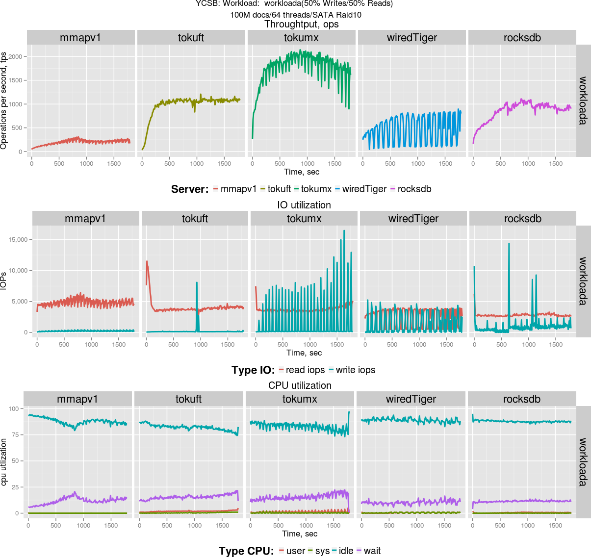

.. _mongodb-ycsb-ct720-jul2015.1:

======================
MongoDB YCSB benchmark
======================

Benchmark date: Jun 2015.

The goal was to evaluate different available storage engines for MongoDB.
The workload is `YCSB <https://github.com/brianfrankcooper/YCSB>`_.
The load is designed to be a heavy IO-load on the fast (FusionIO Duo) and slow(SAS raid10) storage.

The benchmark was done on the server  :ref:`ct720-server` with RAID0 for FusionIO PCI-e card and 
RAID10 over 8 SAS hard drives as a storage

Workloads description
=====================

YCSB benchmark has six core workloads:

Workload A
----------
::

  Update heavy workload. This workload has a mix of 50/50 reads and writes. 
  An application example is a session store recording recent actions.

  Read/update ratio: 50/50

Workload B
----------
::

  Read mostly workload. This workload has a 95/5 reads/write mix. 
  Application example: photo tagging; add a tag is an update, but most operations are to read tags.

  Read/update ratio: 95/5

Workload C
----------
::

  Read only. This workload is 100% read.

  Read/update ratio: 100/0

Workload D
----------
::

  Read latest workload. In this workload, new records are inserted(5%), and the most recently 
  inserted records are the most popular so we read them(95%).

  Read/update/insert ratio: 95/0/5

Workload E
----------
::

  Short ranges
  In this workload, short ranges of records are queried, instead of individual records. 
  Application example: threaded conversations, where each scan is for the posts in 
  a given thread (assumed to be clustered by thread id).

  Scan/insert ratio: 95/5

Workload F
----------
::

  Read-modify-write. In this workload, the client will read a record, modify it, and write 
  back the changes. Application example: user database, where user records are read and 
  modified by the user or to record user activity.

  Read/read-modify-write ratio: 50/50

Workload Setup
==============

* NUM_COLLECTIONS=1
* NUM_DOCUMENTS_PER_COLLECTION=100.000.000 (each record - 10 fields, 100 bytes each, plus key)
* NUM_THREADS=64
* RUN_TIME_MINUTES=30
* REQUEST DISTRIBUTION: zipfian

Below storage size of the data reported by MongoDB:

========== =========== ================
  engine   compression storage size
========== =========== ================
mmapv1     none        206.777.207.344
wiredTiger snappy      121.504.636.928
rocksdb    snappy      116.787.953.408
TokuSE     quicklz     152.521.670.656
TokuMX     quicklz     150.239.969.280
========== =========== ================

I use following cache/total memory configuration (configured with cgroup):

* 8GiB cache / 16GiB total

For MMAP engine there is no cache configuration, so only total memory limit is applied.

- binaries for MongoDB which includes mmapv1, WiredTiger, RocksDB storage engines [#f1]_
- binary for Percona TokuMX 2.0.1 [#f2]_
- binary for TokuMXse RC6 [#f3]_ (storage engine based on TokuFT for MongoDB 3.0)

Startup command lines
=====================

MongoDB MMAP

.. code-block:: bash

	$MONGODIR/mongod --dbpath=$DATADIR --logpath=$1/server.log

MongoDB wiredTiger

.. code-block:: bash

	$MONGODIR/mongod --dbpath=$DATADIR --storageEngine=wiredTiger \
	--wiredTigerCacheSizeGB=X --wiredTigerJournalCompressor=none 

RocksDB

.. code-block:: bash

	$MONGODIR/mongod --dbpath=$DATADIR --storageEngine=rocksdb \
	--rocksdbCacheSizeGB=X

Percona TokuMXse

.. code-block:: bash

	$MONGODIR/mongod --dbpath=$DATADIR --storageEngine=tokuft \
	--tokuftCollectionReadPageSize=16384 --tokuftCollectionCompression=quicklz \
	--tokuftCollectionFanout=128 --tokuftIndexReadPageSize=16384 \
	--tokuftIndexCompression=quicklz --tokuftIndexFanout=128 \
	--tokuftEngineCacheSize=X --syncdelay=900

Percona TokuMX 

.. code-block:: bash

	$MONGODIR/mongod --dbpath=$DATADIR --setParameter="defaultCompression=quicklz" \
	--setParameter="defaultFanout=128" --setParameter="defaultReadPageSize=16384" \
	--setParameter="fastUpdates=true" --cacheSize=X --checkpointPeriod=900

Results:
========

Summary: Fast vs Slow storage
-----------------------------

Slow storage:
-------------
YCSB-Workload A
++++++++++++++++

YCSB-Workload B 
++++++++++++++++

YCSB-Workload C 
+++++++++++++++

.. image:: img/ycsb-ct720.1/ycsb-workloadc-sataraid.png
	:width: 800px
	:height: 600px

YCSB-Workload D
++++++++++++++++ 

Fast storage
------------
YCSB-Workload A 
+++++++++++++++

YCSB-Workload B 
++++++++++++++++++++++++++++++++++++++++++++++++++++++++

YCSB-Workload C 
++++++++++++++++++++++++++++++++++++++++++++++++++++++++

YCSB-Workload D 
++++++++++++++++++++++++++++++++++++++++++++++++++++++++++++++++

.. rubric:: Footnotes

.. [#f1] Link to download `MongoDB with RocksDB <http://percona-lab-mongorocks.s3.amazonaws.com/mongo-rocks-3.0.4-pre-STATIC.tar.gz>`_ .

.. [#f2] `Percona TokuMX 2.0.1 <http://www.tokutek.com/tokumx-for-mongodb/download-community/>`_

.. [#f3] `Percona TokuMXse RC6 <https://www.percona.com/downloads/TESTING/percona-tokumxse/percona-tokumxse-3.0.3-1.0-rc.6/>`_

